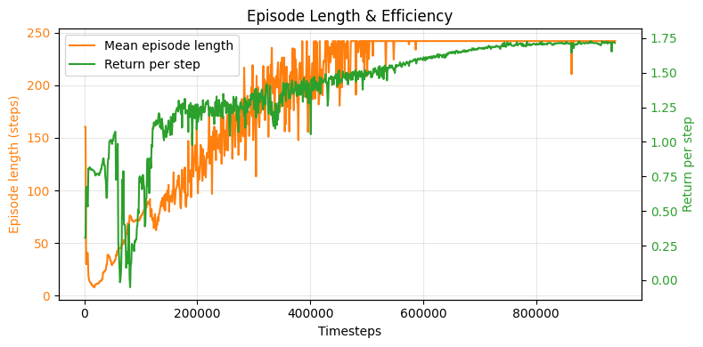
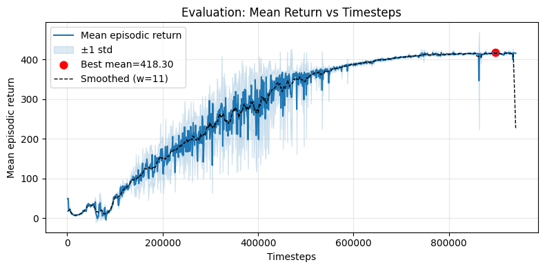
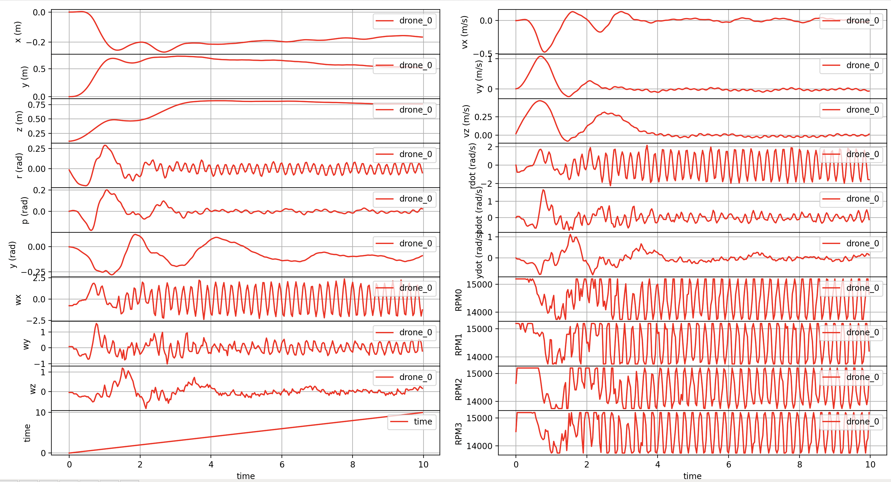

# Q1 

### Demo  


# Q2 

### File Locations

For observation state refer to: 
`def _observationSpace(self)` in `gym-pybullet-drones/gym_pybullet_drones/envs/BaseRLAviary.py`

For action state refer to:
`def _actionSpace(self)` in `gym-pybullet-drones/gym_pybullet_drones/envs/BaseRLAviary.py`

For reward function refer to:
`def _computeReward(self)` in `gym-pybullet-drones/gym_pybullet_drones/envs/HoverAviary.py`

### Observation State 

- **Position** (3D): `obs[0:3]` → (x, y, z) coordinates in world frame
- **Euler Angles** (3D): `obs[7:10]` → (roll, pitch, yaw) orientation
- **Linear Velocity** (3D): `obs[10:13]` → (vx, vy, vz) velocity
- **Angular Velocity** (3D): `obs[13:16]` → (wx, wy, wz) angular velocity

### Action State

- Dimensions: 4D action vector $\mathbf{a} = [a_1, a_2, a_3, a_4]^T$
- Range: Each $a_i \in [-1, +1]$
- Physical meaning: RPM adjustment coefficients for four propellers
- Action Processing
  $$\text{RPM}_i = \text{HOVER\_RPM} \times (1 + 0.05 \times a_i)$$

  When $a_i = -1$: $\text{RPM}_i = 0.95 \times \text{HOVER\_RPM}$ (95% of hover RPM)

  When $a_i = 0$: $\text{RPM}_i = \text{HOVER\_RPM}$ (baseline hover RPM)  

  When $a_i = +1$: $\text{RPM}_i = 1.05 \times \text{HOVER\_RPM}$ (105% of hover RPM)

  This allows fine-grained control with $\pm 5\%$ adjustment around the stable hovering RPM.

### Reward Function

$$r_t = \max(0, 2 - \|\mathbf{p}_{target} - \mathbf{p}_{current}\|^4)$$

Where:
- $\mathbf{p}_{target} = [0, 0, 1]^T$ (hovering target)
- $\mathbf{p}_{current} = \text{state}[0:3]$ (drone's current position)

#### Reward Characteristics

1. **Maximum reward**: $2.0$ (when drone is exactly at target position)
2. **Distance penalty**: Uses fourth power ($\cdot^4$) for aggressive penalization
3. **Zero reward threshold**: When distance $> 2^{1/4} \approx 1.19$ meters
4. **Reward range**: $[0, 2]$

#### Reward Behavior
- **At target** (distance $= 0$): $r_t = 2.0$
- **Close to target** (distance $= 0.5$): $r_t = 2 - (0.5)^4 = 2 - 0.0625 = 1.9375$
- **Moderate distance** (distance $= 1.0$): $r_t = 2 - (1.0)^4 = 2 - 1 = 1.0$  
- **Far from target** (distance $= 1.2$): $r_t = \max(0, 2 - (1.2)^4) = \max(0, 2 - 2.07) = 0$

# Q3

### Demo


### Code Changes

#### PPO training loop.

`learnQ3.py` builds a single-env PPO agent, evaluates every 1 000 steps, and uses `StopTrainingOnRewardThreshold(430)` to capture the best checkpoint for later playback, reward_threshold is set to 430 to ensure the model trains sufficiently well before stopping. 

```python
train_env = make_vec_env(HoverAviaryQ3, env_kwargs=dict(obs=DEFAULT_OBS, act=DEFAULT_ACT), n_envs=1, seed=0)
model = PPO('MlpPolicy', train_env, verbose=1)
callback_on_best = StopTrainingOnRewardThreshold(reward_threshold=430.0, verbose=1)
eval_callback = EvalCallback(eval_env, callback_on_new_best=callback_on_best,
                             best_model_save_path=filename+'/', eval_freq=1000, deterministic=True)
model.learn(total_timesteps=int(1e7), callback=eval_callback, log_interval=100)
```

#### Environment shaping
`HoverAviaryQ3` pins the target at $(0, 0.5, 0.8)$, limits each rollout to 8 s, and truncates out-of-bounds or highly tilted flights while caching the previous action so we can penalize jerky thrust changes.
 
`gym_pybullet_drones/envs/HoverAviaryQ3.py`:
```python
self.TARGET_POS = np.array([0, 0.5, 0.8])
self.EPISODE_LEN_SEC = 8
self.last_action = np.zeros(4)
...
def _computeTruncated(self):
    state = self._getDroneStateVector(0)
    if abs(state[0]) > 1.5 or abs(state[1]) > 1.5 or state[2] > 2.0:
        return True
    if abs(state[7]) > 0.4 or abs(state[8]) > 0.4:
        return True
    return self.step_counter/self.PYB_FREQ > self.EPISODE_LEN_SEC
```

#### Reward shaping

The design of the reward function is the most critical aspect of shaping the agent's behavior. The goal is to create a function that not only guides the drone to the target coordinates but also incentivizes it to do so in a stable, smooth, and efficient manner. Our final reward function, $R_t$, at each timestep $t$ is a composite of a primary position-based reward, several penalties for undesirable behavior, and a bonus for high precision.

The total reward is defined by the following formula:

$$R_t = \underbrace{\max(0, 2 - ||\mathbf{W} \cdot \vec{e}_p||_2^4)}_{\text{Position Reward}} - \underbrace{\lambda_{vel}||\vec{v}||_2 - \lambda_{z}|e_{p,z}| - \lambda_{att}||\vec{\phi}||_2 - \lambda_{smooth}||\vec{a}_t - \vec{a}_{t-1}||_2}_{\text{Stability Penalties}} + \underbrace{\lambda_{bonus} \cdot \mathbb{I}(||\vec{e}_p||_2 < \epsilon)}_{\text{Precision Bonus}}$$

The components of this function are designed as follows:

* **Position-Based Reward**: This is the core component that drives the agent towards the target.
    * $\vec{e}_p = \vec{p}_{target} - \vec{p}$ is the position error vector.
    * $\mathbf{W} = \text{diag}(1.15, 1.05, 1.25)$ is a diagonal weighting matrix that allows us to prioritize accuracy on specific axes. In this case, we place the highest importance on the Z-axis (altitude) and X-axis to counteract observed drift and overshoot.
    * The term $2 - ||\mathbf{W} \cdot \vec{e}_p||_2^4$ creates a potential field that peaks at the target. The power of 4 creates a very sharp drop-off in reward as the drone moves away, strongly discouraging deviation. The `max(0, ...)` term ensures the reward is never negative from this component alone.

* **Stability Penalties**: These terms are crucial for teaching the drone *how* to fly, not just *where* to fly.
    * **Velocity Penalty ($\lambda_{vel}=0.5$)**: Penalizes the magnitude of the drone's velocity vector $\vec{v}$. This discourages aggressive, high-speed flight and reduces the tendency to overshoot the target. We also add an extra Z-velocity penalty ($\lambda_{z}=0.1$) to specifically combat altitude overshoot.
    * **Attitude Penalty ($\lambda_{att}=0.2$)**: Penalizes the magnitude of the roll and pitch angles, $\vec{\phi} = [\phi, \theta]^T$. This encourages the drone to remain level and stable.
    * **Action Smoothness Penalty ($\lambda_{smooth}=0.1$)**: Penalizes the difference between the current action $\vec{a}_t$ and the previous action $\vec{a}_{t-1}$. This is critical for preventing jerky, high-frequency motor commands, resulting in smoother flight and more efficient energy consumption.

* **Precision Bonus**:
    * $\mathbb{I}(||\vec{e}_p||_2 < \epsilon)$ is an indicator function that returns 1 if the drone is within a small tolerance radius $\epsilon$ (2 cm) of the target, and 0 otherwise.
    * When activated, it adds a constant bonus reward ($\lambda_{bonus}=0.5$). This creates a strong incentive for the agent to overcome the "stable offset" problem, where penalties might otherwise discourage the final, fine-tuned movements required to achieve perfect accuracy.
  
```python
def _computeReward(self):
    s = self._getDroneStateVector(0)
    pos = s[0:3]
    rot = s[7:9]
    vel = s[10:13]

    err = self.TARGET_POS - pos
    
    weight_err = np.array([
        err[0] * 1.15,  # X error
        err[1] * 1.05,  # Y error
        err[2] * 1.25   # Z error with 1.25x weight!
    ])
    
    weighted_dist = np.linalg.norm(weight_err)
    r = max(0, 2 - weighted_dist**4)
    velocity_penalty = np.linalg.norm(vel)
    r -= 0.5 * velocity_penalty
    r -= 0.1 * np.linalg.norm(err[2])
    orientation_penalty = np.linalg.norm(rot) # Penalize only roll and pitch
    r -= 0.2 * orientation_penalty
    if self.is_first_step:
        self.is_first_step = False
        self.last_action = self.action
    action_smoothness_penalty = np.linalg.norm(self.action - self.last_action)
    self.last_action = self.action
    r -= 0.1 * action_smoothness_penalty
    if np.linalg.norm(err) < 0.02:
        r += 0.5  # Bonus for being very close to the target
    return r
```

#### Remove termination

In reinforcement learning for control tasks, early termination upon reaching a success condition is often counterproductive. We have explicitly removed this logic from the `_computeTerminated` function for a critical reason.

The core idea is to shift the agent's objective from **"get to the target"** to **"stay at the target."**

If the episode were to end the moment the drone's position error was less than 0.01 meters, the agent would learn to prioritize reaching this state as quickly as possible. This often results in a "touch-and-go" strategy, where the agent learns to dive towards the target with high velocity, caring only about the moment it enters the success radius, not about the instability or overshoot that occurs immediately after.

By removing this termination condition, we force the agent to continue operating for the full episode duration (8 seconds). The agent's goal now becomes to **maximize the cumulative reward over the entire episode**. The only way to achieve a high cumulative score is to:
1.  Reach the target position efficiently.
2.  **Remain at or very near the target position** for the rest of the episode, continuously accumulating high rewards and avoiding penalties.

This fundamentally transforms the task from a sprint into a marathon of stability, compelling the agent to learn a true hovering policy rather than just a target-reaching maneuver.

```python
def _computeTerminated(self):
    # state = self._getDroneStateVector(0)
    # pos = state[0:3]
    # if np.linalg.norm(self.TARGET_POS-pos) < 0.01: #.0001:
    #     return True
    # else:
    return False
```

### Training Analysis 

Figure 1 (Episode Length & Efficiency)


Figure 2 (Mean Return)


The training process can be divided into two distinct phases, each characterized by different learning dynamics and performance metrics.

#### Exploration and Survival Learning Phase (0 - 600,000 Timesteps)
  
  In the initial and middle stages of training, the agent's behavior was dominated by exploration. As seen in Figure 1 (Episode Length & Efficiency).

  Mean Episode Length (Orange Line): During this phase, the episode length started from very low values (indicating that the drone quickly failed by crashing or flying out of bounds) and steadily increased amidst significant fluctuations. This demonstrates that the agent was progressively learning the fundamental skills of flight through trial and error—specifically, how to avoid termination conditions and "survive" longer in the environment.

  Return per Step (Green Line): This curve shows a clear upward trend, mirroring the increase in survival time. As the drone's survivability improved, it also began to learn how to approach the target, thereby earning higher rewards per unit of time and improving its task "efficiency."

#### Policy Optimization and Convergence Phase (600,000 - 900,000 Timesteps)
  
  In the later stages of training, the model's performance began to stabilize and mature.

  Episode Length Reaches Maximum: As seen in Figure 1, the mean episode length stabilized at the theoretical maximum of 240 steps. This signifies that the agent had fully mastered the ability to fly stably for the entire 8-second episode without triggering any fault conditions.

  Reward Rate Reaches Plateau: In Figure 2 (Mean Return), the mean episodic return (blue line), which represents the core performance metric, gradually flattened after 700,000 timesteps, indicating that it had reached a performance plateau.

  Policy Stability: Also in Figure 2, the blue shaded area (±1 standard deviation) became extremely narrow. This indicates that the model's policy had converged. It was no longer achieving high scores sporadically but could do so consistently across multiple evaluations, demonstrating a reliable and robust strategy.

### Test Results

Figure 3 (Test Flight Data)


#### Trajectory and Stability Analysis
The agent demonstrates excellent performance by successfully navigating to the target coordinates of (x=0, y=0.5, z=0.8). After an initial, brief stabilization period of about 4 seconds, the drone achieves a true hover state. Positional deviations become minimal, and velocities in all three axes converge to nearly zero. This indicates that the agent has learned to control both its position and its stability with high precision.

The attitude (roll and pitch) remains level throughout the stable phase, which is crucial for hovering. Most notably, the motor RPM commands are smooth, showing far less oscillation than in previous iterations. This is a direct result of the action smoothness penalty in the reward function, leading to a more efficient and stable control strategy.

#### Conclusion
The final model successfully overcame previous challenges like altitude overshoot and control signal oscillation. It demonstrates a robust, efficient, and precise solution to the hovering task, achieving high stability with smooth control inputs.

# Code 

The code is available at: [https://github.com/annajcy/gym-pybullet-drones](https://github.com/annajcy/gym-pybullet-drones), forked from [https://github.com/NUS-HcRL/gym-pybullet-drones](https://github.com/NUS-HcRL/gym-pybullet-drones).

